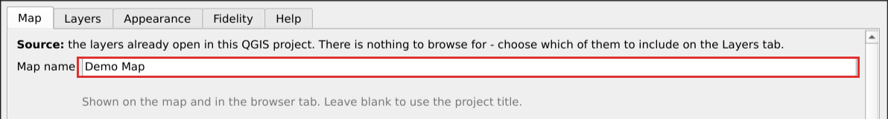
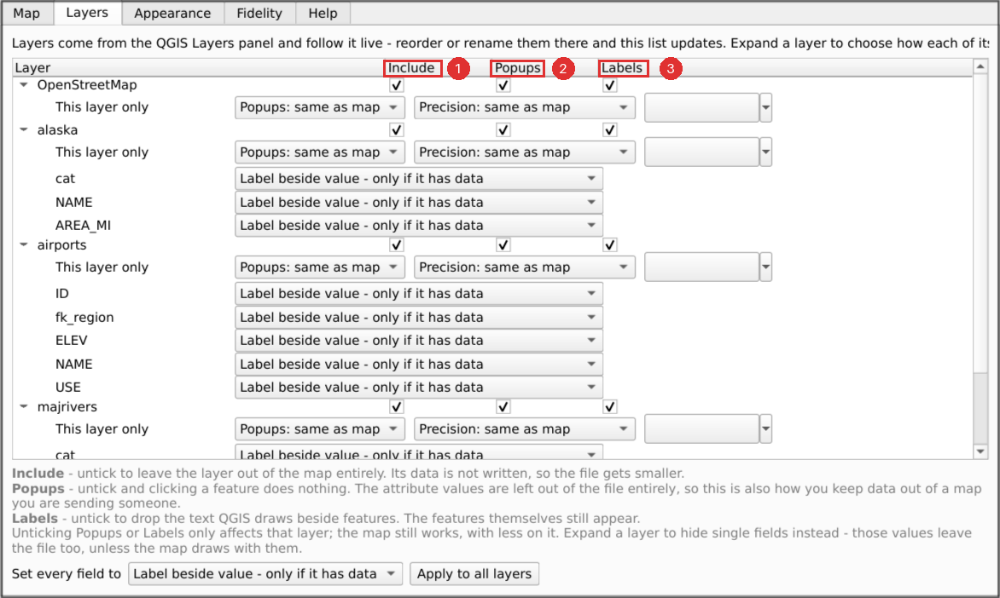
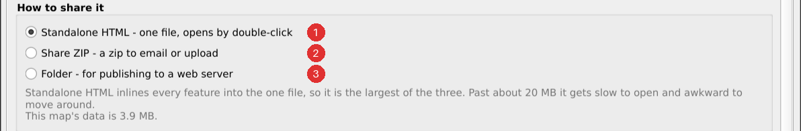
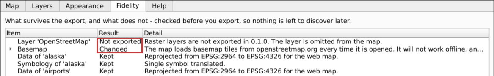

# Your first export

## 1. Build the map in QGIS

The plugin exports the project as it is, so compose it first: load your layers,
style them, and set the canvas to the view you want as the map's starting point.

Layer order matters and is taken from the QGIS Layers panel - the topmost layer
draws on top, exactly as on the QGIS canvas.

## 2. Open the plugin

**Web → QGIS2WebMap by NIKA → Create web map**, or the toolbar button.

The dialog is non-modal: QGIS stays usable behind it. Reorder or rename layers in
the Layers panel and the plugin's list follows immediately - there is nothing to
refresh.

## 3. Name the map

The **Map name** field at the top of the Map tab is the title shown on the
exported map. Leave it blank to use the project title.

## 4. Choose the layers

The plugin exports **the layers already open in this QGIS project**. There is no
file to browse for and no source to pick - build the map you want in QGIS, and
the plugin exports what you built.

On the **Layers** tab, each layer has three tick boxes:

| Box | Ticked | Unticked |
|---|---|---|
| **Include** | The layer is in the map | The layer is left out entirely, and its data is not written to the file |
| **Popups** | Clicking a feature shows its attributes | Clicking does nothing, and the attribute values are **not written to the file** |
| **Labels** | Text you set in QGIS is drawn beside features | No text; the features themselves are unaffected |

Two of these are worth knowing about beyond the tidiness:

- Unticking **Popups** is how you keep attribute data out of a map you are
  sending someone. The values are not merely hidden - they never reach the file,
  so there is nothing to find by opening it in a text editor.
- Unticking **Include** or **Popups** makes the exported file smaller, which
  matters most for [Standalone HTML](sharing.md).

Unticking any of them affects that layer only. The map still works, with less on
it. Settings are remembered per layer, and they survive changes to the project.

**Hiding one field rather than all of them.** Expand a layer to list its fields,
each with its own setting. **Do not show this field** removes that field's values
from the file, exactly as unticking Popups does for the whole layer; the other
settings choose how the value is laid out in the popup. Use *Set every field to*
with **Apply to all layers** to set them in bulk.

One exception, and it is deliberate: a field the map *draws* with - the one a
categorised or graduated style is based on, the one labels read their text from,
or an extrusion height - stays in the file even when you hide it. Removing it
would not conceal anything, since it is on the map either way; it would only
break the drawing.

## 5. Preview

**Preview** builds the map and opens it in your default browser. Nothing opens a
browser on its own - only this button does.

With **Live preview** ticked, the map is served from your own machine and the tab
updates by itself as you change settings, keeping your position on the map. Change
a colour or switch a layer off and watch it happen; there is no need to press
Preview again.

Untick **Live preview** to open the map as a file instead. The tab then only
changes when you press Preview again or reload it. The setting is remembered
between projects.

If the preview cannot be served - a firewall or a locked-down machine - it opens
as a file automatically and tells you so. Nothing is lost.

## 6. Export

Pick how you want to share it on the Map tab, then press **Export**.

The line under those choices says what you are about to produce, and the strip
above the buttons says what will change on the way out. If Export is greyed out,
the reason is shown beside it.

Once an export succeeds, **Open exported map** opens the real file - the one you
would send to someone - so you can check it before sharing.

## 7. Check the Fidelity tab

Before sending the map on, look at **Fidelity**. It lists everything that
changed on the way out of QGIS - symbology that could not be translated exactly,
settings that will not appear, layers that were left out. Nothing is dropped
silently.

