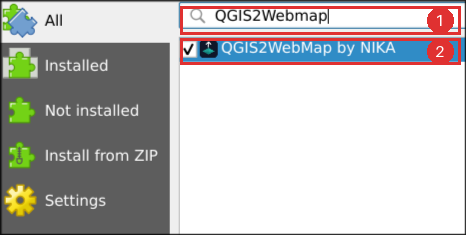
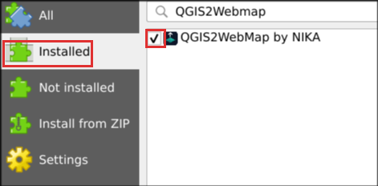

# Troubleshooting

Every entry here is a real reported failure, with what causes it and what to do.
If yours is not listed, the QGIS **Log Messages** panel usually says why: open
**View → Panels → Log Messages** and read the `QGIS2WebMap` tab.

## Installing

### Searching the plugin list finds nothing

1. Make sure **All** is selected on the left of the Manage and Install Plugins
   window, not **Installed**.

   

2. Check the spelling. It is one word: `QGIS2WebMap`. Searching `OnlyMap` also
   finds it.
3. If the whole list is empty, QGIS cannot reach the plugin repository — often a
   workplace firewall. Check **Settings → Options → Network** for a proxy, then
   see [installing from a file](installation.md#if-your-organisation-blocks-the-plugin-repository).

### It installed, but there is no Web menu entry

1. **Plugins → Manage and Install Plugins → Installed** — confirm
   **QGIS2WebMap by NIKA** is there and its box is ticked.
2. If it is there but unticked, tick it. The menu entry and toolbar button
   appear straight away.

   

3. If it is ticked and still missing, open **View → Panels → Log Messages** and
   read the `QGIS2WebMap` tab for an error.

### It installs but errors on an older QGIS

The plugin requires **QGIS 3.44 or newer**. Earlier versions are not supported —
not as a policy but as a measured fact: they fail. QGIS 4 is supported.

Check with **Help → About**.

### QGIS closed while I was using it

That is a bug, not a normal outcome. The plugin never closes QGIS, and the only
thing it ever installs is the OnlyMap runtime, once, after asking. Please
[report it](https://github.com/NikaGeospatial/qgis2webmap/issues) with the tail
of the Log Messages panel.

## The runtime download

### It asks to download something. Is that expected?

Yes, once per computer. The **OnlyMap runtime** is the code that draws the map in
a browser, and it is built into every map you export — which is exactly what lets
someone open your map with nothing installed. It is a separate commercial product
with its own licence, which is why it is fetched rather than bundled into this
GPL plugin, and why you are shown the licence first.

About 4.5 MB. After that, everything works offline, and exporting itself never
touches the network. See [privacy](privacy.md) for what that request does and
does not send.

### The download fails

The download uses QGIS's own network settings, so check
**Settings → Options → Network** first — a proxy configured there is used
automatically.

If outside downloads are blocked entirely, install the runtime by hand:

1. On a machine with access, download the package from
   [npm](https://www.npmjs.com/package/@nika-js/onlymap) and unpack it.
2. Copy the `dist` folder — you need `onlymap.standalone.js` and `onlymapjs.css`.
3. On the offline machine, set the environment variable `ONLYMAP_RUNTIME_DIR` to
   that folder **before starting QGIS**.

The plugin uses a runtime it finds that way and never asks to download.

### The Processing algorithm stops immediately on a new machine

Expected, and it says so. *Export to OnlyMap web map* cannot show you a licence —
there is nobody to show it to during a batch run — so on a computer that has
never installed the runtime it refuses rather than downloading silently.

Export once from **Web → QGIS2WebMap by NIKA** and the algorithm works from then
on.

## Exporting

### Export is greyed out

The reason is printed beside the button. The three you will meet:

| The reason says | What to do |
|---|---|
| *Add a vector layer to the project to export.* | The project has no vector layer. Raster-only projects have nothing to export |
| *Tick at least one layer to include.* | Everything is unticked in the **Include** column on the Layers tab |
| Something else | Open the **Fidelity** tab. A **Blocked** item names the layer and the reason |

### The Fidelity tab takes a long time to fill

It reads every feature of every layer, so a large project takes a while. The
progress bar names the layer it is on. It runs on a background thread — the
window stays usable, and **Cancel** stops it.

### Nothing happens when I press Export twice

By design. One job runs at a time, and both buttons go dark while it runs, so a
second press cannot start a second export.

### The exported file is enormous

Standalone HTML writes every feature into the file itself. That is what makes it
self-contained, and it is inherent to the format — a map with 20 MB of data
produces a file of at least 20 MB.

In order of how much they save:

1. Untick **Popups** on layers whose attributes nobody needs. Those values leave
   the file entirely.
2. Untick **Include** on layers that are not carrying their weight.
3. On the Map tab, tick **Export only the features in this view** to drop
   everything outside your current extent.
4. Set **Coordinate precision** to 6 decimal places. This is irreversible; six
   places is about 0.1 m at the equator.
5. Switch to **Share ZIP**, which compresses the same map.

## Opening and sharing

### The map is blank, or shows a message about JavaScript

You are looking at it somewhere that does not run JavaScript — an email client's
preview pane, a file manager's preview, a chat app's inline viewer. The message
is deliberate; a blank window would be worse. Save the file and open it in a
browser.

### Double-clicking the Folder export does not work

Correct, and it cannot. Browsers refuse to load the runtime from a separate file
on a `file://` page. The Folder mode exists for uploading to a web server.

Use **Standalone HTML** for anything that has to open off a disk.

### The map never arrived / the attachment was stripped

Many mail providers and corporate filters quarantine or remove `.html`
attachments, because HTML is a common phishing vector. This is the single most
common delivery failure.

Export as **Share ZIP** instead. A zip usually passes filters a bare `.html` does
not, and it carries a short README telling the recipient how to open it.

### The recipient says features are missing

Check the **Fidelity** tab against that layer. The usual causes:

- **Export only the features in this view** was ticked, and the missing features
  were outside your QGIS extent at export time.
- The layer is unticked in **Include**.
- The map is being served from a real domain and is over the free plan's limits —
  see below.

## Hosted maps

None of this applies to a file someone double-clicks, emails, or opens from
`localhost`. Those draw everything, with no licence key.

### Layers past the fifth do not render, or a layer is truncated

The OnlyMap free plan allows **5 layers per map** and **25,000 features per
layer**, and those limits apply only to a page served over `http(s)` from a real
domain. A layer past 25,000 features is truncated to its first 25,000 while still
looking complete, which is why the Fidelity tab names every layer over a limit
before you host.

An OnlyMap licence key lifts the limits and removes the on-map badge. Supply it
through the `ONLYMAP_LICENSE_KEY` environment variable or the Processing
algorithm's licence parameter. Lifted limits are a technical convenience and not
a licence grant — commercial use needs a key either way. See
[size limits on the free plan](supported-features.md#size-limits-on-the-free-plan).

### The map is blank on my own site but fine locally

Your site's **Content Security Policy**. The map's styling is driven by
expressions the runtime evaluates at draw time, so a policy without
`'unsafe-eval'` in `script-src` stops it rendering — not partly, entirely. See
[hosting](hosting.md#if-your-site-sets-a-content-security-policy).

### Basemap tiles do not load for the recipient

The tiles come from the provider's servers on every open, so the recipient needs
internet access and an unblocked route to that provider. If you need a map that
works with no connection at all, set **Basemap** to **None** — the default.

## Still stuck

- [Open an issue](https://github.com/NikaGeospatial/qgis2webmap/issues), with the
  `QGIS2WebMap` tab of the Log Messages panel and your QGIS version
- Email [support@nikaplanet.com](mailto:support@nikaplanet.com)
